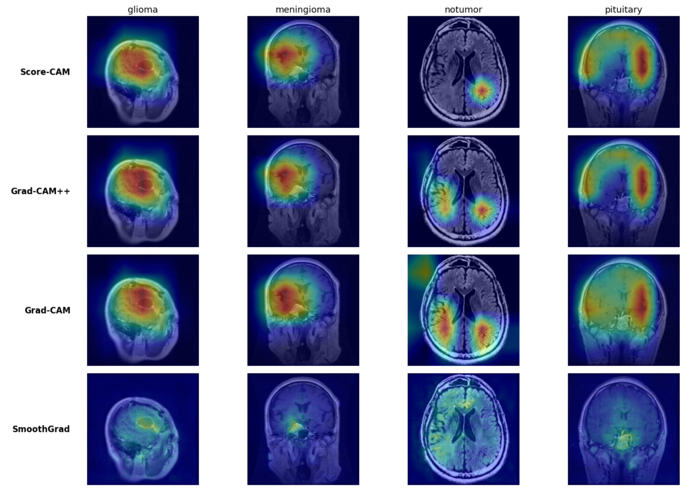

# Brain Tumor Classification using Optimized Deep Learning and Explainable AI

This repository presents an optimized deep learning framework for **brain tumor classification from MRI images** using convolutional neural networks and explainable AI techniques.

The project was developed as part of a **Bachelor’s thesis in Computer Science (Data Analysis curriculum)** at the **University of Messina**.

The research investigates how model optimization strategies, attention mechanisms, and explainable AI techniques influence both **classification performance** and **model interpretability** in medical imaging.

---

# Motivation

Brain tumors represent a serious neurological condition where early detection is critical for effective treatment planning.

Magnetic Resonance Imaging (MRI) is the primary diagnostic tool for detecting brain tumors, but manual interpretation of MRI scans requires experienced radiologists and can be time-consuming.

Deep learning has demonstrated strong performance in medical image classification tasks. However, real-world medical applications require:

- high classification accuracy
- robustness to variations in imaging data
- **interpretability of model decisions**

This project aims to design a deep learning pipeline capable of delivering strong predictive performance while maintaining transparency through explainable AI methods.

---

# Dataset

The models were trained on a **Brain Tumor MRI dataset** containing four classes:

- Glioma
- Meningioma
- Pituitary tumor
- No tumor

Preprocessing steps included:

- image resizing
- normalization
- dataset balancing
- data augmentation

---

# Deep Learning Pipeline

The proposed pipeline consists of several stages:

### Data Preprocessing

- image normalization
- resizing
- augmentation
- dataset balancing

### Model Training

Multiple CNN architectures and configurations were evaluated.

### Optimization Strategies

Several improvements were tested:

- AdamW optimizer
- tuned augmentation pipeline
- label smoothing
- improved preprocessing

### Attention Mechanisms

To enhance feature representation, the following attention modules were explored:

- **ECA (Efficient Channel Attention)**
- **GAM (Global Attention Mechanism)**
- **CBAM (Convolutional Block Attention Module)**

### Explainable AI

To ensure interpretability, explainable AI methods were applied to visualize the regions responsible for model predictions.

---

# Experimental Models

The following model configurations were evaluated:

1. EfficientNetV2-S baseline
2. EfficientNetV2-S optimized (AdamW + augmentation)
3. EfficientNet with attention mechanisms
4. EfficientNet with improved preprocessing
5. EfficientNet with label smoothing

---

# Results

The models were evaluated using the following metrics:

- Accuracy
- Precision
- Recall
- F1-score

## Model Performance

| Model Configuration | Test Accuracy |
|--------------------|--------------|
| EfficientNetV2-S (baseline) | **98.77%** |
| EfficientNetV2-S + AdamW + tuned augmentation | **98.95%** |
| EfficientNetV2-S + improved preprocessing | **98.94%** |
| EfficientNetV2-S + Label Smoothing | **99.00%** |
| EfficientNet + ECA attention | **98.43%** |
| EfficientNet + ECA + GAM | **98.00%** |
| EfficientNet + CBAM | **97.40%** |

Macro-averaged classification metrics for the best configurations:

Precision: **0.99**  
Recall: **0.99**  
F1-score: **0.99**

The results demonstrate that EfficientNetV2-S provides a strong transfer learning baseline, while optimization strategies such as **AdamW and label smoothing slightly improve generalization performance**.

Attention modules produced competitive performance but did not surpass the optimized baseline model.

---

# Robustness Analysis

Additional experiments evaluated model robustness under image perturbations such as:

- motion blur
- compression artifacts
- intensity variations

The optimized EfficientNet model maintained high classification accuracy under most perturbations, demonstrating strong generalization ability.

---

# Explainable AI (XAI)

To analyze model interpretability, several explainability techniques were applied:

- Score-CAM
- Grad-CAM++
- Grad-CAM
- SmoothGrad

These methods highlight the image regions that contribute most strongly to the model’s predictions.

The visualizations show that the model consistently focuses on **anatomically plausible tumor regions**, supporting the reliability of the learned features.

## XAI Visualization



Across different methods, activation maps converge on the tumor areas, demonstrating consistent feature attribution.

---

## Repository Structure

```text
.
├── BestModel.ipynb              - Final optimized model and evaluation
├── EfficientNetV2S.ipynb        - Baseline EfficientNetV2-S implementation
├── EfficientNetV2STuned.ipynb   - Optimized training (AdamW + augmentation)
├── XceptionNet.ipynb            - Alternative CNN architecture experiment
├── ECA+GAM.ipynb                - Attention mechanisms experiment
├── CBAM.ipynb                   - Convolutional Block Attention Module experiment
├── LabelSmoothing.ipynb         - Label smoothing training experiment
│
└── requirements.txt             - Python dependencies for reproducing experiments

```

---

# Thesis

This repository accompanies the Bachelor thesis:

**"An Optimized and Interpretable Deep Learning Framework for Brain Tumor Classification"**

University of Messina  
Department of Mathematical and Computer Sciences

Supervisor:  
Prof. Daniele Ravi

Academic Year  
2025 / 2026

---

# Author

Zhalgas Abylkassymov  
BSc Computer Science — Data Analysis
